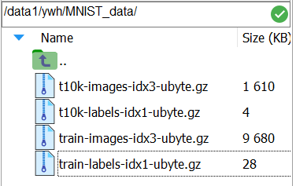
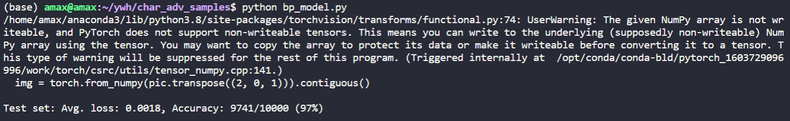

# Bp-simple-model-mnist

### 这个work是干什么的

很简单，就是单隐含层的BP Network在mnist数据集上训练与测试的程序，这是torch版本的。

### 我为什么要做这个仓库


昨天在我的大学生活中对本人帮助极大的杨*卿学长来问了我这一个问题(我直接好家伙)，正好借着这个机会，对深度学习小白以及没接触过深度学习代码的其他领域科研工作者。展示如何在mnist数据集上训练一个非常非常简单的网络，也就是我这里作为例子的BP神经网络。这个工作很简单，估计也没什么人看，我就不用我的chinglish来丢人了。

### 环境依赖(Linux为例)

首先你需要一个anaconda的环境，不管是base也好，虚拟环境也罢，只要能运行python3就行。

然后装载python依赖库，我把所有需要的库放在了`requirements.txt`文件中，只需要在命令行中执行以下命令

```shell
pip install -r requirements.txt
```

就能装载所有的依赖库了。

### 准备数据集

其实可以用torch自带的直接网上下载，但是考虑到大部分人用这个下载非常慢，而且本人经常用mnist数据集，所以我选择直接下载到本地，用的时候调用即可。mnist数据集可以到官网(http://yann.lecun.com/exdb/mnist/)直接下载，记得要fq，不然下载不了。

下载完之后不用解压，直接放在一个文件夹下，例如`MNIST_data`文件夹下。



如上图所示，我放在了`/data1/ywh/MNIST_data/`这个文件夹下面，大家记得在`util.py`这个函数中修改`folder`的位置。可以看出，四个数据集，训练集+测试集，图像+标签。

### 运行代码

代码灰常简单，简单到只有两个程式代码。首先说`util.py`这块主要是处理调用本地mnist数据集的，只需要改其中`folder`的路径即可，就在程序中，相信非常好找。

然后就是我们的模型训练与测试代码了，也就是`bp_model.py`。这个程序也贼简单，可以发现，主函数就两行

```python
if __name__ == "__main__":
    train()
    test()
```

很明显，一行训练，一行测试。训练的时候，请用`#`注释掉test，测试的时候，也同样注释掉train，因为所有训练好的模型，我用`torch.save`保存在本目录了，所以训练完模型，本目录下会多一个`bp_model.pt`的模型文件。

运行代码可以直接在命令行输入

```python
python bp_model.py
```

然后跑代码用`test()`来测试一下，经过了50epoch的训练，准确率达到了97%，虽然不高，但是对于如此简单的网络而言，就还行了，这份代码主要还是帮助小白理解模型训练测试的思路与torch代码。




